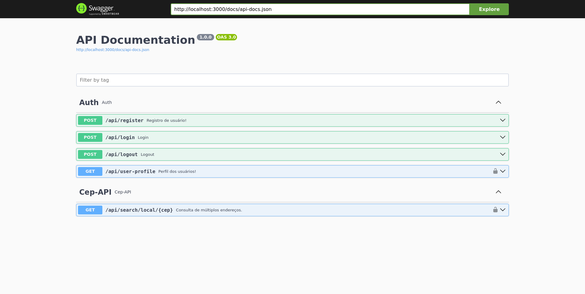

# Desafio Salvus

### Check

- [x] API COM LARAVEL
- [x] DOCKER EMBARCADO
- [x] RETORNO DA API VIACEP NO ESCOPO DESEJADO
- [x] DOCUMENTAÇÃO VIA SWAGGER 
- [x] AUTÊNTICAÇÃO E AUTORIZAÇÃO VIA JSON WEB TOKEN (http only cookie/secure cookie)

## 💻 Pré-requisitos

Antes de começar, verifique se você atendeu aos seguintes requisitos:

- Docker version 26+

## 📜 Observações
  A porta 3000 será mapeada para o projeto, a porta 5432 para o POSTGRES, assegure que ambas estejam disponíveis.

## 🚀 Instalação

```bash
# Clone este repositório
$ git clone https://github.com/JoaolimaDev/selecao-increazy
# Acesse a pasta do projeto no seu terminal/cmd
$ cd selecao-increazy
```

## ☕  Swagger disponível :

URL : http://localhost:3000/api/documentation



## 🤝 Colaboradores

<table>
  <tr>
    <td align="center">
      <a href="https://www.linkedin.com/in/jo%C3%A3o-vitor-de-lima-74441b1b1/" title="Linkedin">
        <br>
        <sub>
          <b>João lima</b>
        </sub>
      </a>
    </td>
  </tr>
</table>